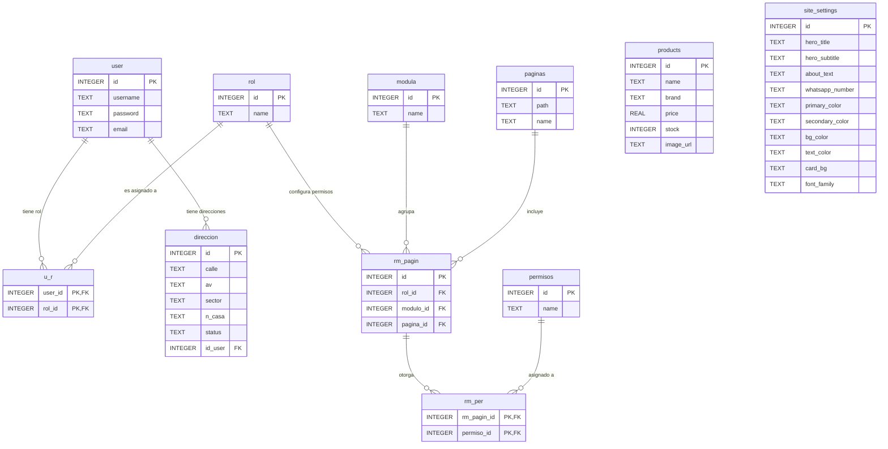

# Diagrama Entidad-Relación (Base de Datos)

Este diagrama detalla las tablas de la base de datos `sugarimport.db` y sus relaciones.

```mermaid
erDiagram
    user ||--o{ u_r : "tiene rol"
    rol ||--o{ u_r : "es asignado a"
    user ||--o{ direccion : "tiene direcciones"
    rol ||--o{ rm_pagin : "configura permisos"
    modula ||--o{ rm_pagin : "agrupa"
    paginas ||--o{ rm_pagin : "incluye"
    rm_pagin ||--o{ rm_per : "otorga"
    permisos ||--o{ rm_per : "asignado a"

    user {
        INTEGER id PK
        TEXT username
        TEXT password
        TEXT email
    }
    rol {
        INTEGER id PK
        TEXT name
    }
    u_r {
        INTEGER user_id PK,FK
        INTEGER rol_id PK,FK
    }
    direccion {
        INTEGER id PK
        TEXT calle
        TEXT av
        TEXT sector
        TEXT n_casa
        TEXT status
        INTEGER id_user FK
    }
    modula {
        INTEGER id PK
        TEXT name
    }
    paginas {
        INTEGER id PK
        TEXT path
        TEXT name
    }
    rm_pagin {
        INTEGER id PK
        INTEGER rol_id FK
        INTEGER modulo_id FK
        INTEGER pagina_id FK
    }
    permisos {
        INTEGER id PK
        TEXT name
    }
    rm_per {
        INTEGER rm_pagin_id PK,FK
        INTEGER permiso_id PK,FK
    }
    products {
        INTEGER id PK
        TEXT name
        TEXT brand
        REAL price
        INTEGER stock
        TEXT image_url
    }
    site_settings {
        INTEGER id PK
        TEXT hero_title
        TEXT hero_subtitle
        TEXT about_text
        TEXT whatsapp_number
        TEXT primary_color
        TEXT secondary_color
        TEXT bg_color
        TEXT text_color
        TEXT card_bg
        TEXT font_family
    }
```
