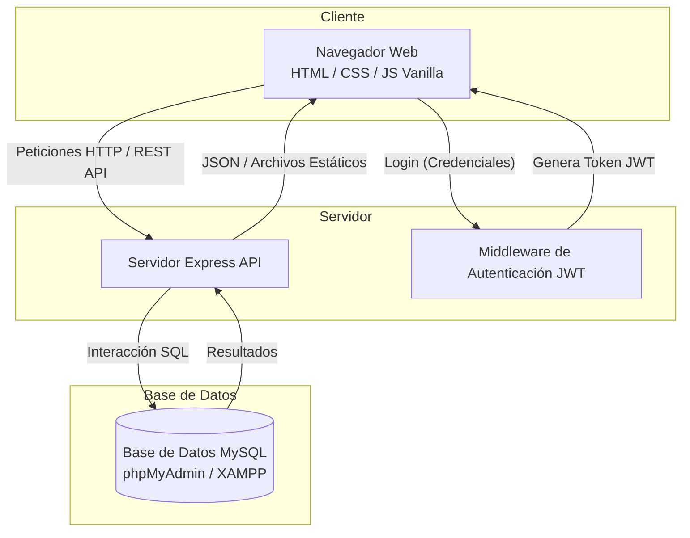

# Arquitectura del Sistema

Este diagrama muestra cómo interactúan los componentes principales de la aplicación SugarImport.

```mermaid
graph TD
    subgraph Cliente
        Browser[Navegador Web\nHTML / CSS / JS Vanilla]
    end

    subgraph Servidor
        NodeApp[Servidor Express API]
        MiddlewareAuth[Middleware de Autenticación JWT]
    end

    subgraph Base de Datos
        MySQL[(Base de Datos MySQL\nphpMyAdmin / XAMPP)]
    end

    %% Relaciones
    Browser -- Peticiones HTTP / REST API --> NodeApp
    NodeApp -- Interacción SQL --> MySQL
    MySQL -- Resultados --> NodeApp
    NodeApp -- JSON / Archivos Estáticos --> Browser
    
    %% Detalle de Auth
    Browser -- Login (Credenciales) --> MiddlewareAuth
    MiddlewareAuth -- Genera Token JWT --> Browser
```
