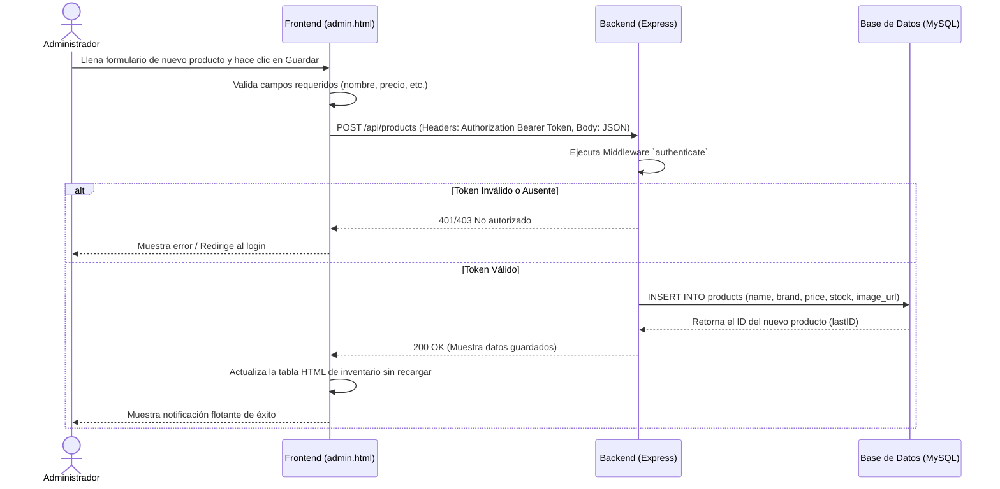

# Diagrama de Casos de Uso (Secuencia de Inventario)

Este diagrama de secuencia ilustra un caso de uso clave: El proceso del Administrador al agregar un nuevo producto al catálogo.

```mermaid
sequenceDiagram
    actor Admin as Administrador
    participant UI as Frontend (admin.html)
    participant API as Backend (Express)
    participant DB as Base de Datos (MySQL)

    Admin->>UI: Llena formulario de nuevo producto y hace clic en Guardar
    UI->>UI: Valida campos requeridos (nombre, precio, etc.)
    UI->>API: POST /api/products (Headers: Authorization Bearer Token, Body: JSON)
    
    API->>API: Ejecuta Middleware `authenticate`
    alt Token Inválido o Ausente
        API-->>UI: 401/403 No autorizado
        UI-->>Admin: Muestra error / Redirige al login
    else Token Válido
        API->>DB: INSERT INTO products (name, brand, price, stock, image_url)
        DB-->>API: Retorna el ID del nuevo producto (lastID)
        API-->>UI: 200 OK (Muestra datos guardados)
        UI->>UI: Actualiza la tabla HTML de inventario sin recargar
        UI-->>Admin: Muestra notificación flotante de éxito
    end
```
